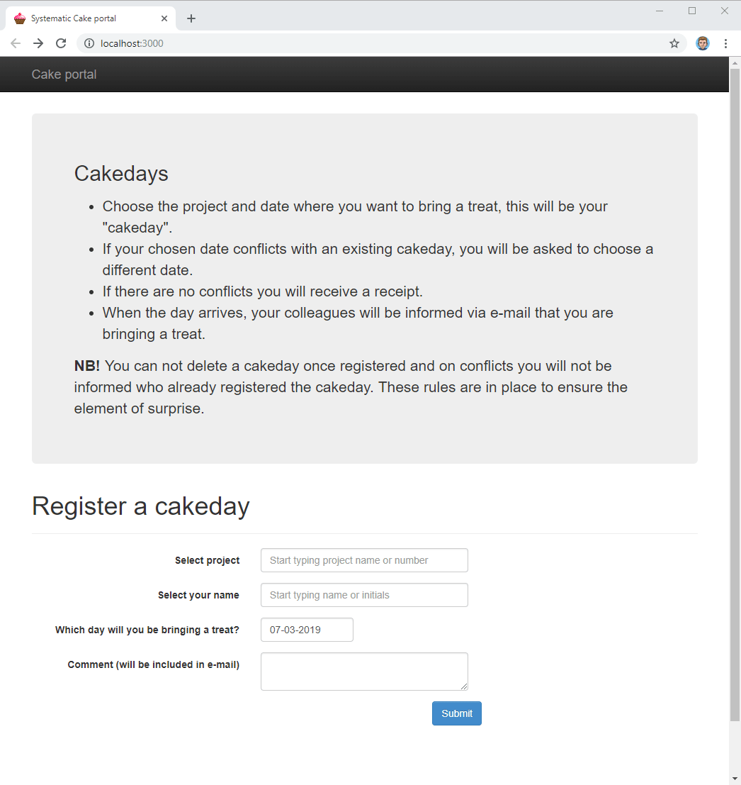

# mergecake

Demo:

## Prerequisites

You will need [Leiningen][1] 2.0 or above installed.

[1]: https://github.com/technomancy/leiningen

## Running

To start a web server for the application, run:

    lein ring server

## Changing project/user data

Modify db/preload/users.txt and db/preload/projects.txt

## License

Copyright © 2014 FIXME
